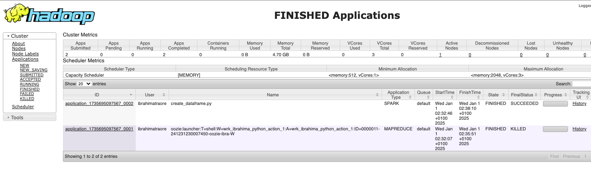
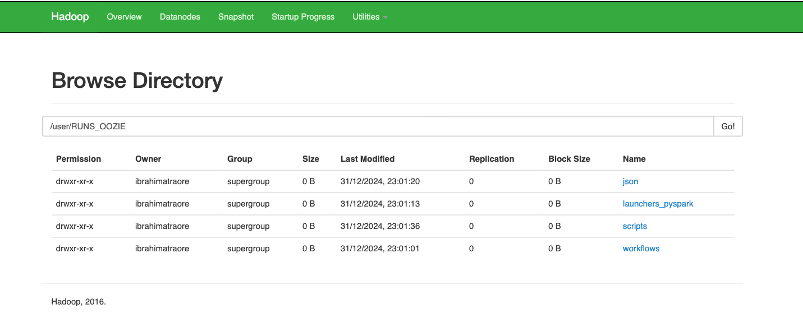
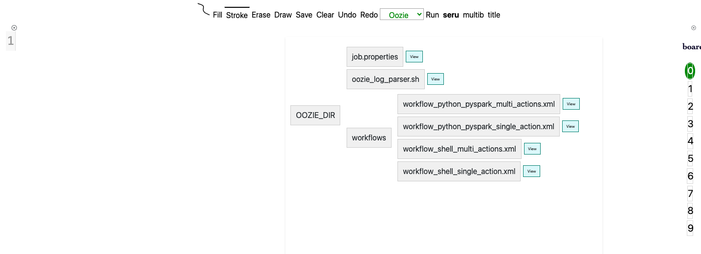

#  RUN_OOZIE_LOCALLY


  <h3><a href="http://localhost:8088/cluster/" >http://localhost:8088/cluster/</a></h3>


  <hr>
  <h3><a href="http://localhost:50070/explorer.html#/user/RUNS_OOZIE" >http://localhost:50070/explorer.html#/user/RUNS_OOZIE</a></h3>
  
  <hr>

  <hr>
  <p>My own angular ts - backend server application to schedule oozie job</p>
  <h3><a href="http://localhost:3000/" >http://localhost:3000/</a></h3>
  
  <hr>
  
# -------------------------------------
#
#  PART  0: Directories and files descriptions
#
# ------------------------------------------
+> dependencies: the python pyspark custom package i use as library for my pyspark script
+> python-scripts:  contains the python scripts i need to launch using oozie workflow
+> shell-scripts:  contains the shell scripts i want to test also

+> file;json: just a json file , can be called inside python scripts

+> job;properties:  the job.properties i run to submit job to oozie 
+> job.xml: dynamical generated file, can be deleted

+>launch_only_pyspark: the launcher for python pyspark, it is set inside <exec></exec> tag inside my python pyspark  workflows

+> launch_python_or_shell_wrks.sh: this script is the second mode of submitting job to oozie: ./launch_python_or_shell_wrks.sh (see details below)

+>  oozie_copy_scripts_wrks_launchers_to_hdfs.sh: You need to copy all your needles to hdfs using this script

+>  oozie_log_parser.sh : if you use seconfd mode of submitting job,  this script can help you see parsed or non parsed logs  (see details below)

+>  purge_oozie_infos.sql  : remove all metadata from oozie if you use oozie to run many jobs before. (see details below inside this sql file )

+>  start_hadoop.sh: You need to start hadoop cluster before all
+> start_oozie_and_his_sharelib.sh: To use oozie, use this script to start it server and map the sharelib and copy jars to hdfs

+> workflow_python_pyspark_multi_actions.xml
workflow_python_pyspark_single_action.xml
workflow_shell_multi_actions.xml
workflow_shell_single_action.xml       => the differents workflows i want to submit


# -------------------------------------
#
#  PART  I: Start hadoop and oozie server
#
# ------------------------------------------

### A-  start hadoop cluster if not yet done

```
source start_hadoop.sh

```

### B-  start your ozie server:
this will start your oozie server and map the sharelib for you, also it will copy the jars (sharelib neded jars inside corresponding hdfs jars)

```
source start_oozie_and_his_sharelib.sh

```

### C-  Copy yowards hdfs all the scripts, workflows, launchers, dependencies needed :
this will start your oozie server and map the sharelib for you

```
./ oozie_copy_scripts_wrks_launchers_to_hdfs.s

```

# -------------------------------------
#
#  PART  II: Clean oozie  metadata (optionnal)
#
# ------------------------------------------

### A-  start cleaning oozie metadata to free memories (you can do this if you already has run oozie many times )

```
follow instruction inside:  purge_oozie_infos.sql 

```

# -------------------------------------
#
#  PART  III:  HOW TO RUN  OOZIE JOB?
#
# ------------------------------------------

### A-  Using job.properties file

```
1- define your parameter inside job.properties file:
===================================

nameNode=hdfs://localhost:9000
jobTracker=localhost:8032
queueName=default

# ------------ workflow argument ---------------------
configSparkOptions=--executor-memory 4g  --queue ${queueName} --num-executors 4 --executor-cores 2 --driver-memory 4g --master yarn --conf spark.yarn.executor.memoryOverhead=512 --conf spark.yarn.driver.memoryOverhead=512 --conf spark.pyspark.driver.python=python3 --conf spark.pyspark.python=python3

#configSparkOptions=--queue ${queueName} --master yarn
myPythonPysparkScriptCreate=hdfs://localhost:9000/user/RUNS_OOZIE/scripts/python/create_dataframe.py
myPythonPysparkScriptRead=hdfs://localhost:9000/user/RUNS_OOZIE/scripts/python/read_dataframe.py
paramJsonFile=${nameNode}/user/RUNS_OOZIE/json/file.json
paramTody="2024-12-29"
paramMe="Ibrahimadev"


# ------------ sharelib ---------------------
oozie.use.system.libpath=false
#oozie.libpath=${nameNode}/user/oozie/share/lib

# ------------------- where to find the workflow inside hdfs ----------
worflows_dir_ib_hdfsr=RUNS_OOZIE
#oozie.wf.application.path=${nameNode}/user/${worflows_dir_ib_hdfsr}/workflows/workflow_shell_single_action.xml
oozie.wf.application.path=${nameNode}/user/${worflows_dir_ib_hdfsr}/workflows/workflow_shell_multi_actions.xml
#oozie.wf.application.path=${nameNode}/user/${worflows_dir_ib_hdfs}/workflows/workflow_python_pyspark_single_action.xml
#oozie.wf.application.path=${nameNode}/user/${worflows_dir_ib_hdfs}/workflows/workflow_python_pyspark_multi_actions.xml

```

As you can see above , i want to run  workflow_shell_multi_actions.xml which lias inside hdfs here: oozie.wf.application.path=${nameNode}/user/${worflows_dir_ib_hdfsr}/workflows/workflow_shell_multi_actions.xml

```
2-  Run the command :

 oozie job -oozie http://localhost:11000/oozie -config job.properties -run

 the above command must returns jobId like:  0000029-241230082740787-oozie-ibra-W


```

```
2- Track the job : http://localhost:8088/cluster

 -Check there the status of jobs 'ACCEPTED - RUNNING - FINISHING"  by just clicking thos buttons

 -Also see the logs: 
By clicking the applicationId of the job -> tools -> Local logs

-You can also see logs using:
oozie job -oozie myjobId
Example: http://localhost:11000/oozie -log 0000029-241230082740787-oozie-ibra-W
```


### B-  Using  dynamical generated job.xml file posted to oozie server via CURL: generate dynamical mainJob;properties file  and base on that generate dynamical job.xml file

```
1- Set your parameters of the minJob.properties content inside launch_python_or_shell_wrks.sh 

2- RUN ./launch_python_or_shell_wrks.sh 
this will generated dynamical mainJob.properties , base on this it will also generated dynamical job.xml files 
and submit that file to oozie using curl

3-While running, this script will save the jobId inside /tmp/current_saved_wrk_id.txt

4-check the logs by running: 
./oozie_log_parser.sh 

this script  oozie_log_parser.sh  will read the current jobId from  tmp/current_saved_wrk_id.txt and show you parsing or none parsing log (see details inside script header)

```

# -------------------------------------
#
#  PART  IV:  LIST OF  OOZIE COMMANDS
#
# ------------------------------------------
You can see all oozie commands by running:

```
./shell-scripts/script.sh 

```

OR see list beelow

```
# Job Management Commands
Commands for managing workflow jobs in Oozie.

| Command                                                   | Description                                                                                    |
|-----------------------------------------------------------|--------------------------------------------------------------------------------|
 oozie job -oozie http://localhost:11000/oozie -config <file> -run                         Submits a job with the specified configuration file and starts it.                              
 oozie job -oozie http://localhost:11000/oozie -info <job_id>                              Retrieves detailed information about the specified Oozie job.                                   
 oozie job -oozie http://localhost:11000/oozie -log <job_id>                               Retrieves logs for the specified Oozie job.                                                     
 oozie job -oozie http://localhost:11000/oozie -kill <job_id>                              Kills the specified Oozie job.                                                                  
 oozie job -oozie http://localhost:11000/oozie -suspend <job_id>                           Suspends a running Oozie job.                                                                  
 oozie job -oozie http://localhost:11000/oozie -resume <job_id>                            Resumes a suspended Oozie job.                                                                 
 oozie job -oozie http://localhost:11000/oozie -rerun <job_id>                             Reruns a failed Oozie workflow job. Options like -refresh or -status can be used to control rerun. 
 oozie job -oozie http://localhost:11000/oozie -change <job_id> -value <property=value>    Changes properties (e.g., priority) of a running Oozie job.                                    

# Coordinator Management Commands
Commands for managing coordinator jobs in Oozie.

| Command                                                   | Description                                                                                    |
|-----------------------------------------------------------|--------------------------------------------------------------------------------|
 oozie job -oozie http://localhost:11000/oozie -start <coordinator_id>     Starts a coordinator job.                                                                    
 oozie job -oozie http://localhost:11000/oozie -dryrun <coordinator_id>    Tests the coordinator configuration without executing it.                                    
 oozie job -oozie http://localhost:11000/oozie -submit <config_file>       Submits a new coordinator job using the specified configuration file.                        

# Bundle Management Commands
Commands for managing bundle jobs in Oozie.

| Command                                                   | Description                                                                                    |
|-----------------------------------------------------------|--------------------------------------------------------------------------------|
 oozie job -oozie http://localhost:11000/oozie -bundle <config_file>       Submits a new bundle job using the specified configuration file.                              
 oozie job -oozie http://localhost:11000/oozie -bundle-info <bundle_id>    Retrieves information about the specified bundle job.                                        
 oozie job -oozie http://localhost:11000/oozie -bundle-log <bundle_id>     Fetches logs related to a bundle job.                                                        

# Admin Commands
Commands for administering the Oozie server.

| Command                                                   | Description                                                                                    |
|-----------------------------------------------------------|--------------------------------------------------------------------------------|
 oozie admin -oozie http://localhost:11000/oozie -status         Checks the status of the Oozie server. Returns System mode: NORMAL if the server is running. 
 oozie admin -oozie http://localhost:11000/oozie -list           Lists all available services and configurations on the Oozie server.                          
 oozie admin -oozie http://localhost:11000/oozie -reload         Reloads Oozie configurations without restarting the server.                                   
 oozie admin -oozie http://localhost:11000/oozie -os-env         Displays Oozie's operating system environment variables.                                      
 oozie admin -oozie http://localhost:11000/oozie -java-env       Displays Oozie's Java system properties.                                                     

# Other Useful Commands
Additional commands for Oozie usage.

| Command                                                   | Description                                                                                    |
|-----------------------------------------------------------|--------------------------------------------------------------------------------|
 oozie validate <workflow_file>           Validates an Oozie workflow XML file.                                                         
 oozie help                               Displays help for all Oozie commands.                                                         
 oozie version                            Displays the version of the Oozie client.                                                     

# Commonly Used Options
Description of frequently used options for Oozie commands.

| Command                                                   | Description                                                                                    |
|-----------------------------------------------------------|--------------------------------------------------------------------------------|
 Option                                               Description                                                                                       
----------------------------                         ---------------------------------------------------------------------------------------------------
 -oozie http://localhost:11000/oozie                  Specifies the Oozie server URL. Default is http://localhost:11000/oozie.                         
 -config <file>                                       Specifies a configuration file for the job or command.                                            
 -D <property=value>                                  Sets properties directly via command-line arguments.                                              
 -run                                                 Submits and starts the job in one command.                                                        
 -status                                              Retrieves the status of a job.                                                                    
 -info                                                Fetches detailed information about a job or a component within a job.                             
 -log                                                 Retrieves the logs for a job or its components.                                                 

```
